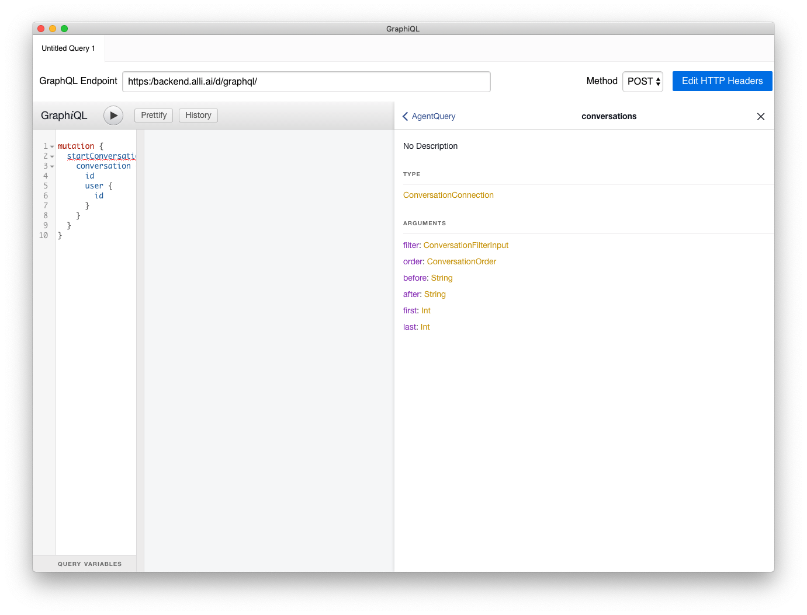

# Agent API Document


## Signup and setting campaign
-   You should see [Alli onboarding document](https://docs.google.com/document/d/1mfgtknMbnzDL6sKBKDOtWC0cnHwX59NT5nqWISqQZCE/edit#heading=h.ubhpu5uvlrg1).

## Tools & Library
GraphQL is implemented over standard HTTP and websocket. So you can choose any http, websocket library like python requests.

- A graphical interative in-brower GraphQL IDE : [https://github.com/graphql/graphiql  
](https://github.com/graphql/graphiql)
-   Python Library : [https://github.com/graphql-python/gql](https://github.com/graphql-python/gql)
-   Java Library : [https://github.com/apollographql/apollo-android](https://github.com/apollographql/apollo-android)
-   Node Library : [https://github.com/apollographql/apollo-client](https://github.com/apollographql/apollo-client)
-   Python websocket library : [https://pypi.org/project/websocket-client/](https://pypi.org/project/websocket-client/)

## Endpoints
- GRAPHQL_ENDPOINT: [https://backend.alli.ai/d/user/](https://backend.alli.ai/d/graphql/)

## Agent API with python example
You can get api lists and arguments, fields using graphiql tool. Please see graphiql's Document section.

### Full example
- Please see example https://github.com/allganize/documents/blob/master/alli_api/agent_api_example.py

### Login
You can get authorization token using signin mutation.
And you can use agent permission apis using this token by sending AUTHORIZATION http header.

**Example**
```
# signin
gql = """
mutation signin($email:String!, $passwd:String!) {
  login(email:$email, password:$passwd) {
    token
  }
}
"""
variables = {
  "email": "",
  "passwd": ""
}

token = execute_gql(GRAPHQL_ENDPOINT, gql, variables=variables)['login']['token']
auth_headers = {
  'AUTHORIZATION': token
}
```

### Get Campaigns
You can get campaign lists using campaigns query.

**Example**

```
# Get campaigns
# Please see graphql relay spec. https://facebook.github.io/relay/graphql/connections.htm
gql = """
query getCampaigns($filter:CampaignFilter) {
  campaigns(filter:$filter) {
    edges {
      node {
        id
        name
      }
    }
  }
}
"""
# You can add CampaignFilter or order. They are not mandatory.
variables = {
}

campaigns = execute_gql(GRAPHQL_ENDPOINT, gql, variables=variables, headers=auth_headers)['campaigns']['edges']
for campaign in campaigns:
  id = campaign['node']['id']
  name = campaign['node']['name']
  print(f"{id}, {name}")

```

### Get Conversations
You can get campaign lists using campaigns query.

**Note**  Conversation list is very long. So please set first or last parameter. 

Please see graphql relay spec. https://facebook.github.io/relay/graphql/connections.htm

**Example**
```
# Get conversations
gql = """
query getConversations($filter:ConversationFilterInput, $limit:Int) {
  conversations(filter:$filter, first:$limit) {
    edges {
      node {
        id
        user {
          ownUserId
        }
        chats {
          edges {
            node {
              ... on UserChat {
                message
              }
              ... on AgentChat {
                message
                agent {
                  name
                }
              }
              ... on BotChat {
                message
                createdAt
                chatOptions
              }
              __typename
            }
          }
        }
      }
    }
  }
}
"""
# You can add ConversationFilterInput or ConversationOrder. They are not mandatory.
variables = {
  "limit": 10  # Please add limit. see
}
conversations = execute_gql(GRAPHQL_ENDPOINT, gql,
              variables=variables,
              headers=auth_headers)['conversations']['edges']
for conv in conversations:
  conv = conv['node']
  id = conv['id']
  user = conv['user']['ownUserId']
  print(f"ConvId({id}), User({user})")
  for chat in conv['chats']['edges']:
    typename, message, options = get_plain_text(chat['node'])
    print(f"\t{typename} : {message}, {options}")
```

### Get User lists
```
# Get users and user variables
# Please see graphql relay spec. https://facebook.github.io/relay/graphql/connections.htm
gql = """
query getUsers($filter:UserFilter, $limit:Int) {
  users(filter:$filter, first:$limit) {
    edges {
      node {
        ownUserId
        name
        online
        variables {
          edges {
            node {
              id
              name
            }
            value
            readOnly
          }
        }
      }
    }
  }
}
"""
# You can add UserFilter.
variables = {
  "limit": 10  # Please add limit. see
}
users = execute_gql(GRAPHQL_ENDPOINT, gql,
          variables=variables,
          headers=auth_headers)['users']['edges']
for user in users:
  user = user['node']
  id = user['ownUserId']
  name = user['name']
  print(f"Id({id}), Name({name})")
```
